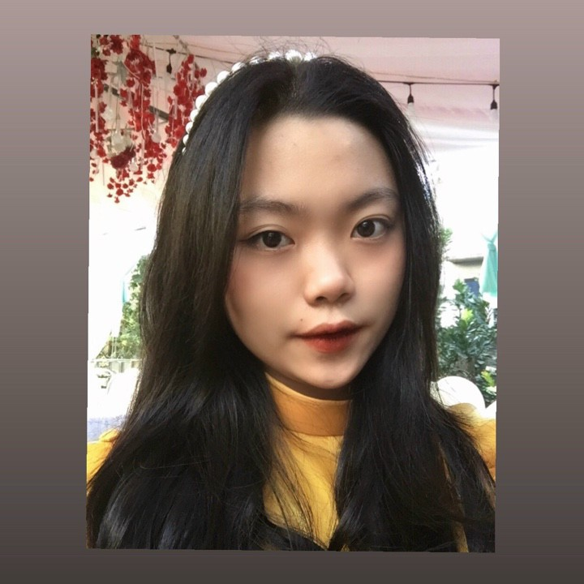

<!-- Preloader -->
        

          

            

            

            

            

            

          

        

<!-- Hieu ung & background -->
      

      

        
❤

        

      
<!-- header -->
      <header id="navigation">
        

          

            <ul class="nav__ul">
              <li class="nav__ambition">Tham Vọng</li>
              <li class="nav__li-logo" >  </li>
              <li class="nav__menu js-buy-ticket">
                <i class="nav__menu-icon ti-menu"></i>
              </li>
            </ul>
          

        

      </header>

<!-- Body -->
    <!-- Love-days -->
    

      
<audio  src="./sound/everything-i-need.mp3" loop controls></audio>

      
Being in Love with you..

      

            

                  <date class="love-days__date">0 DAYS</date>
                  days
            

            <time class="love-days__time">00:00:00</time>
      

          
      

        

              
              
&nbsp;

        

        

              ❤<anni class="love-days__day-begin">...</anni>
        

        

              
              
&nbsp;

        

  

    
 

    

      <h3 class="letter99">Những bức thư gửi cho người yêu</h3>
      

  
        

          

            
bức thư thứ nhất

            <h3>Chào em,</h3>
            

              Vậy là đến kỉ niệm 100 ngày chúng ta đã bắt đầu hành trình yêu nhau. 
              Một con số tuy không nhiều nhưng đã giúp anh phần nào hiểu được tình yêu là gì.
              Những ngày qua, em đã trở thành một phần quan trọng trong cuộc sống của anh và anh biết rằng từ khi gặp em cuộc sống của anh rất có ý nghĩa.
            

            

              Anh muốn dành lời cảm ơn đến em vì đã trao cho anh niềm tin và tình yêu chân thành. 
              Chúng ta đã cùng nhau trải qua nhiều thăng trầm và những khoảnh khắc, 
              và anh biết rằng những lời yêu em dành cho anh sẽ mãi ở lại trong trái tim mình.
            

              

              Anh cảm thấy may mắn vì được có em bên cạnh trong cuộc đời này.
              Em là người đem lại cho anh niềm vui, niềm tin và sự ủng hộ. 
              Anh không thể hạnh phúc hơn khi có em đồng hành. Những lúc buồn và cô đơn, 
              anh luôn tìm đến em và cảm thấy thoải mái hơn khi được nghe lời động viên của em.
              

              

              Nhân dịp kỉ niệm 100 ngày yêu nhau, 
              anh muốn nói rằng anh yêu em và sẽ yêu với tất cả những gì anh có.
              Anh muốn được chia sẻ những niềm vui, nỗi buồn.
                Anh muốn cùng em trải qua cuộc sống này và xây dựng một tương lai tốt đẹp hơn.
              

                Cảm ơn em đã đồng hành cùng anh trong 100 ngày qua 
                và khi anh gặp được em, anh tin rằng chúng ta sẽ cùng nhau đi đến những ngày tháng vui vẻ và hạnh phúc hơn nữa. Anh yêu em rất nhiều.
            

            
28/3/2023  Duy  

          
          
  
        

        

          

            
bức thư thứ hai

            <h3>Dear,</h3>
            

              Anh biết rằng mối quan hệ của chúng ta đã trải qua một số khó khăn và tình cảm giữa chúng ta có vẻ đang bị đi xuống một chút. Nhưng anh không muốn chúng ta nản chí, vì anh tin rằng chúng ta vẫn có thể đưa mối quan hệ của chúng ta lên một nấc thang mới.
            

            

              Anh muốn nói rằng em rất quan trọng đối với anh, anh yêu em rất nhiều. Nhưng cảm giác của anh là em đang không hài lòng. Liệu có phải do một số vấn đề ngày thi của em đang đến khiến em stress hay không và cũng có phần do anh nữa. Hơn ai hết anh hiểu cảm giác đối diện với nỗi sợ trước thi này.
            

              

                Anh sẽ luôn ở đây để lắng nghe và hỗ trợ em trong mọi hoàn cảnh. Chúng ta đã trải qua bao nhiêu thử thách để đến được với nhau và anh không muốn để bất kỳ điều gì làm cho chúng ta rời xa nhau. Anh muốn chúng ta có thể cùng nhau giải quyết mọi vấn đề và để mối quan hệ của chúng ta trở nên ngọt ngào như nó đã từng vậy. 
  
              

              

                Anh viết thư này khi nói chuyện với em xong và em đã phải đi ngủ khi mà vẫn còn cơn tức trong người. Umm.. khá là cũng buồn đấy.  Anh rất tiếc khi bản thân anh đã làm không đủ tốt. Anh mong qua những lời nhắn gửi sẽ khiến em dễ chịu hơn phần nào.
              

  
                
Cuối cùng, anh muốn nói rằng anh yêu em và anh hy vọng chúng ta có thể cùng nhau vượt qua giai đoạn khó khăn này. Anh sẽ luôn sẵn sàng ở bên cạnh và giúp đỡ em. Cũng như lời bài hát vậy: 'Cause you were meant for me, and you're everything I need.
                

            

            
29/3/2023  Duy  

          
   
        

        

          

            
bức thư của em

            

              Giữa biển người rộng mênh mông, dẫu muôn trùng xa cách… thật tuyệt khi chúng ta đã tìm thấy và yêu thương nhau. Không ai định nghĩa được tình yêu là gì? Chẳng có thể nào chứng minh rõ ràng khi yêu con người ta ra sao, có cảm nhận như thế nào? Liệu có phải là cảm giác khi em thấy nhớ anh và luôn muốn anh bên cạnh? Là mỗi khi trời nắng đẹp lại muốn được cùng anh ra sân sưởi ấm, được anh nắm tay dẫn đi dạo như một cách công khai? Liệu có phải chỉ đơn giản như thế, như cách em muốn thấy anh hiện diện trong cuộc sống thường ngày vậy??
            

            

              Anh biết đấy, em thường có tính lo xa, lo anh chê em mập, lo anh còn tình cảm với người khác, nhưng còn lo hơn nếu sau này ta không bên nhau nữa…
  
            

              

                Tương lai rồi sẽ ra sao anh nhỉ? Em không biết và cũng không muốn biết rõ cụ thể sẽ ra sao… Bời em muốn mình cùng cố gắng ở hiện tại. Anh sau này sẽ vẫn nắm tay anh nhé! Cho dù bàn tay em có hơi buốt xíu nhưng bàn tay anh to vậy mà, em nghĩ sẽ bao trọn được thôi. Em mong thế! Trong quá trình trưởng thành của bản thân, em đã từng nghĩ phải thật giỏi, thật độc lập và sống vì mình cũng chẳng cần đến tình yêu!!! Và rồi anh và em đã “tìm thấy nhau”. Đã tiếp xúc rồi trò chuyện, dần dần đã nảy sinh một loại tình cảm giữa đôi người xa lạ chưa hề quen biết… hehe.
  
              

              

                Đoạn tình cảm này, mang đến cho em nhiều cảm xúc “lạ” lắm! Nó khiến em nhớ anh và luôn có suy nghĩ về anh còn lo lắng nữa chú! Quả thực, em yêu anh nhiều lắm!! Anh đừng lo lắng hay tự ti vì hiện tại anh chưa có gì trong tay, cũng đừng buồn vì nước da bánh mật hay đôi mắt chẳng được to lắm! Vì em yêu anh nên tất cả mọi thứ của anh, em đều trân trọng. Vậy nên, hiện tại em muốn “cảm ơn cuộc đời vì đã để anh bước đến, để em ngắm nhìn một người mà em yêu mến!”. Cảm ơn anh đã đến và vì yêu em nên đã chọn ở lại! Yêu anh.
  
              

            

          
  
        

      
        <a class="prev" style="color:#fff " onclick="plusSlides(-1)">&#10094;</a>
        <a class="next" style="color:#fff " onclick="plusSlides(1)">&#10095;</a>
      

    

  
    <!-- 8/3 -->  

    <!-- Question for her -->
      

        <header>
          <!-- Model -->
          <!-- 
<audio src="./sound/everything-i-need.mp3" controls></audio>
 -->

          

            

              

                  <i class="ti-close"></i>
              

              

                Mốc Thời Gian
              
 

              <ul class="nav__menu-modal-ul js-modal-link">
                <li class="nav__menu-modal-list">
                  <a href="#birthday" class="nav__menu-modal-link  ">09/02/2023</a>
                </li>
                <li class="nav__menu-modal-list">
                  <a href="#valentine" class="nav__menu-modal-link ">14/02/2023</a>
                </li>
                <li class="nav__menu-modal-list">
                  <a href="#slide" class="nav__menu-modal-link ">29/03/2023</a>
                </li>
              </ul>
            

          

          
          <h2 id="text3">Em có yêu anh không?...</h2>
          

            

              <h4 id="text4" class="header_music-text">
                Nhớ trả lời thật lòng nhé
              </h4>

            
 
          

        </header>
        <button id="yes" type="button" class="btn btn-danger btn-lg">
          Yêu ơi là yêuuuuuu 
        </button>
        <button id="no" type="button" class="btn btn-info btn-lg ">
          Mơ à :333
        </button>
        

    

    <!-- Slide 1 -->
    

      

        

        

          
          
          
          
          
        

        

          

            
          

  
          

            

              Chúc mừng sinh nhật em!
            

            
 
              Mừng sinh nhật tuổi 19 của em, chúc em thêm tuổi mới thêm nhiều yêu thương, vui vẻ, thật hạnh phúc và luôn yêu cuộc sống này. Thời gian qua có lẽ là rất khó khăn với em. Dẫu vậy em vẫn được đón một ngày sinh nhật đầm ấm bên gia đình, đó là điều rất đáng quý. Khó khăn nào rồi cũng sẽ qua đi và phía trước tương lai đang đón chờ em. Em là một người mà anh rất ngưỡng mộ, một người mà thắng không kiêu, bại không nản. Anh luôn hy vọng mình sẽ đón sinh nhật với em nhiều hơn, để gửi cho em những lời yêu chân thành nhất. Chúc cho mọi điều may mắn sẽ đến với em trong kỳ thi sắp tới. Chúc em luôn giữ vững được sức khỏe của mình trước mọi bệnh tật. Chúc em luôn xinh đẹp rạng ngời như tia nắng xuân. Yêu em.
            

          

        

      

    

    

    <!-- Slide 2 -->
    

        
 &nbspDuy Nguyen ❤ Phương Thảo 

        <canvas id="pinkboard"></canvas>
     

    <!-- Slide 3 -->
    

      

        

          <h1 class="valentine_first vibrate-1">Anh yêu em nhắm nhắm</h1>
          
        

        
          

            <h1 class="valentine_first vibrate-1">Em yêu anh nhắm nhắm</h1>
          
          

      

    

    <!-- Slide 4 -->
    

      

        

          

            
          

          

            

              Đây là Valentine đầu tiên...
            

            

              Tình yêu là gì em nhỉ? Đã lâu lắm rồi em không ngồi một mình để nghiền ngẫm về thực sự ý nghĩa của nó cho đến khi anh yêu em. Và hôm nay, một dịp đại lễ dành cho các cặp đôi đã cập bến. Phố xá sẽ tấp nập cảnh những cặp đôi dắt tay nhau đi dạo trong giai điệu tình tứ. Mấy loại mặt hàng chocolate sẽ nhanh chóng hết veo trên các kệ hàng. Những rạp chiếu phim sẽ bán hết vé vì các cặp đôi đi xem với nhau. Nhưng thật đáng tiếc thay chúng ta vẫn tiếp tục xa cách, chỉ có thể nhìn nhau qua điện thoại, nói những lời yêu thương qua micro. Cũng khá là buồn đó. Anh biết là bản thân em chất chứa nhiều suy nghĩ. Anh chỉ ước có em ở bên cạnh lúc này, ôm em thật chặt để em biết anh yêu em nhiều đến thế nào. Đối với anh Valentine này vẫn rất ấm áp vì trong trái tim anh luôn có em. Yêu em nhiều lắm!
            

          

        

      

    

    <!-- Footer -->
    <footer id="footer">
        

          

            Designed and written by Duyputq.
          

          

            Don't know what to do next? Come and see the most beautiful girl <a class="footer__link" href="https://www.facebook.com/profile.php?id=100034460020271">here</a>!
          

          

            You are everything to me.
          

          

            Have fun!
          

        

        
    </footer>

    <!-- Mã JavaScript -->
    <!-- jQuery first, then Popper.js, then Bootstrap JS -->
    
    
    
    
    
    
    
    
    
    
